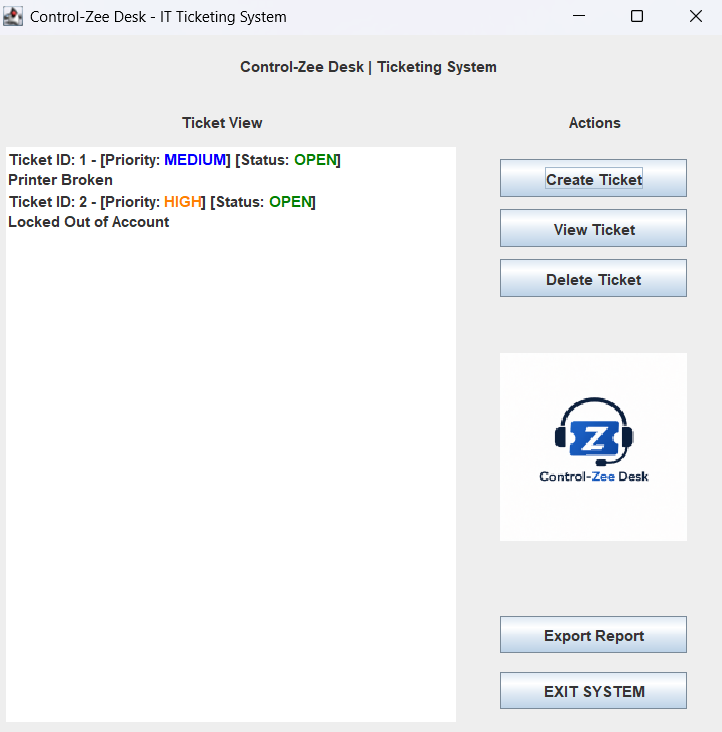
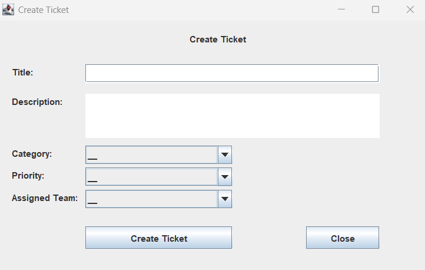
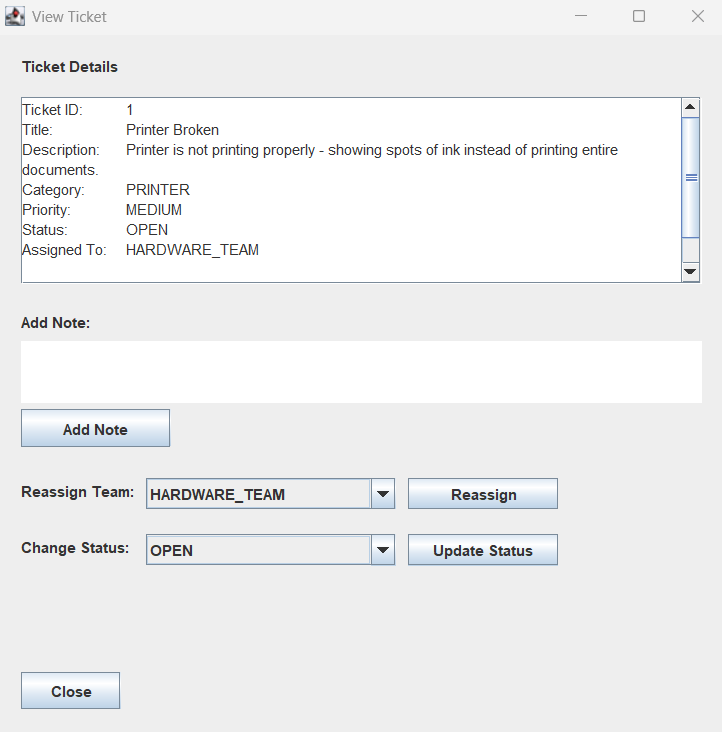

# Control-Zee Desk - IT Ticketing System

Control-Zee Desk is a desktop-based help desk ticketing system built in Java using Swing. It simulates a real-world IT support environment where users can create, manage, and track support tickets efficiently.

---

## Features

### 🎫 Ticket Management
- Create, view, and delete support tickets
- Auto-generated ticket IDs
- Track ticket details including title, description, and category
- Assign tickets to specific support teams

### 🔄 Status & Workflow
- Update ticket status (Open, In Progress, Resolved, Closed)
- Reassign tickets between teams
- Track ticket lifecycle from creation to completion

### 📝 Notes System
- Add internal notes to tickets
- View all notes in a scrollable interface
- Helps simulate real help desk communication

### 🎨 User Interface
- Built with Java Swing (desktop GUI)
- Multi-window system (Main Dashboard, Create Ticket, View Ticket)
- Color-coded ticket list:
  - Priority indicators (Urgent, High, Medium, Low)
  - Status indicators (Open, In Progress, Closed)
- Integrated application logo

### 📄 Reporting
- Export all tickets to a text-based report
- Includes ticket details, status, priority, team, and notes
- Useful for tracking and documentation

---

## 🛠️ Tech Stack

- Java
- Java Swing (GUI)
- ArrayList (Data Storage)
- FileWriter (Report Exporting)

---

## 🚀 Setup Instructions

> [!IMPORTANT]
> Required: Java JDK (8 or newer) and an IDE (IntelliJ, Eclipse, or NetBeans)

1. Clone the repository:
```
git clone https://github.com/json-moore/ControlZee-Desk-Java-Ticketing-System.git
```
3. Open the project in your IDE

4. Run the application:
Run TicketUI.java

5. The application will launch as a desktop window

---

## Project Structure

- Ticket.java → Ticket data model
- TicketManager.java → Core logic and ticket operations
- TicketUI.java → Main application dashboard
- CreateTicketWindow.java → Ticket creation form
- ViewTicketWindow.java → Ticket details and updates

---

## Key Concepts Demonstrated

- Object-Oriented Programming (OOP)
- Encapsulation & Data Modeling
- Event-driven programming (Swing)
- Input validation & error handling
- File handling (report export)
- Separation of concerns (UI vs logic)

---

## Screenshots

### Main Dashboard:

<br>
### Create Ticket Window:

<br>
### View Ticket Window:

